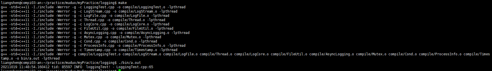

### 核心类 ###
CLogger，其内部实现定义了一个internal 类 Impl，Impl类中包含一个成员mStream， 类型为CLogStream。

CLogStream 类中有一个buffer，所有日志输出最终都是插入此buffer中，CLogStream中重载了不同数据类型的“<<”符号以实现不同数据
类型的插入。


### 宏定义 ###
LogCore.h中定义了不同的宏，如：
#define LOG_TRACE if (CLogger::logLevel() <= CLogger::TRACE) \
  CLogger(__FILE__, __LINE__, CLogger::TRACE, __func__).stream()
此语句定义了一个匿名的对象，其特点是用完即销毁，所以此语句结束后，会立即调用CLogger的析构函数：
```cpp
CLogger::~CLogger()
{
    ///添加日志尾
    mImpl.finish();
    const CLogStream::Buffer& buf(stream().buffer());
    g_output(buf.data(), buf.length());

    if (mImpl.mLevel == FATAL)
    {
        g_flush();
        abort();
    }
}
```
### 编译 ###
- 直接make

